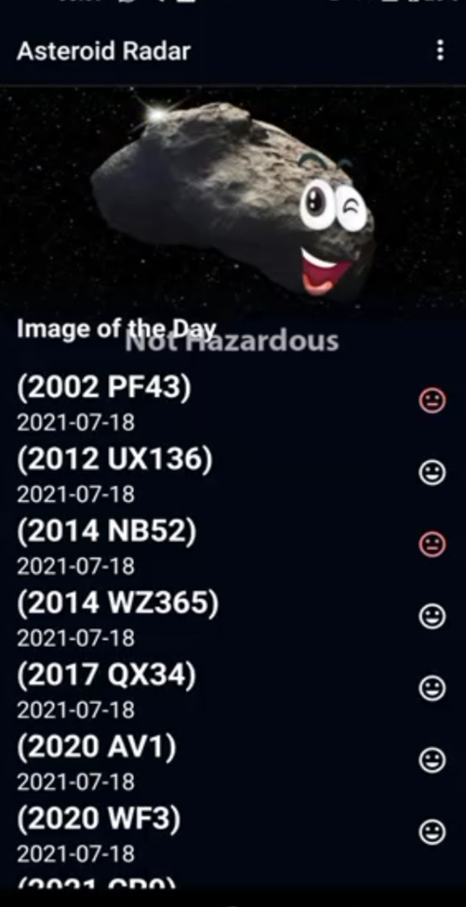
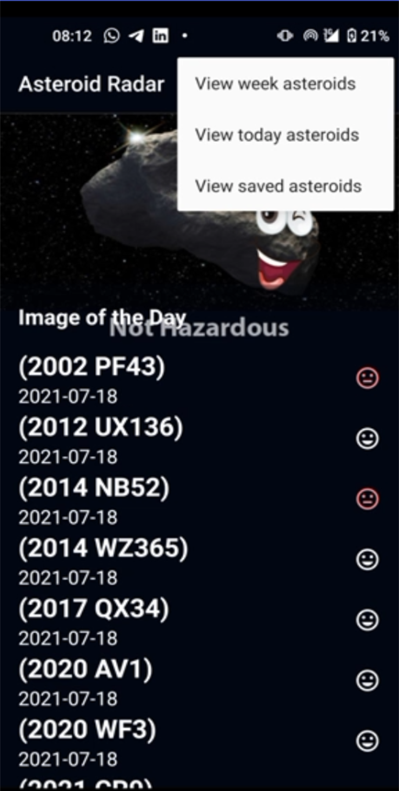
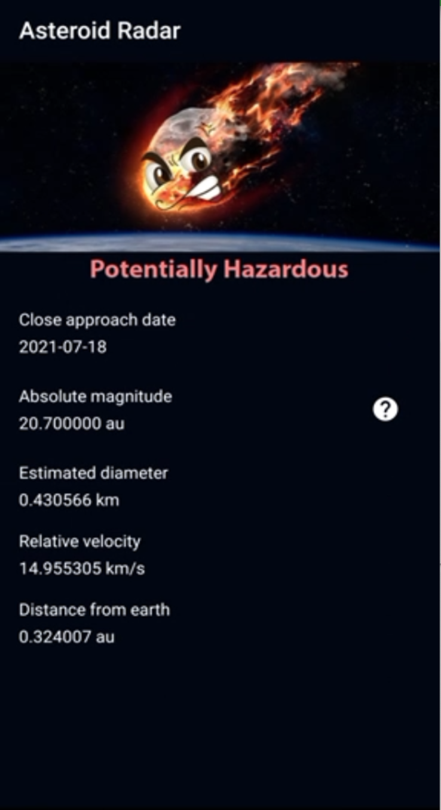
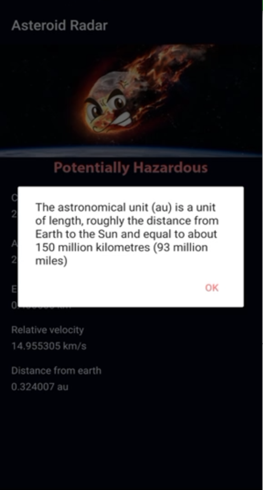

# Asteriod

Asteroid is an application that makes use of free open source API provided by NASA JPL asteroid team.

_This is a custom application in request from Udacity Android Nanodegree Programme._

## Feature
* Kotlin Coroutine for async operations
* liveData an observable data holder class for lifecycle-aware task
* Koin for dependency injection
* Databinding to bind UI layout to data model
* WorkManager for periodic background processes
* Room libray for local caching of data
* Retrofit library for JSON file integration to the app


## Get Started
**As this is an android project, you will need an android device to run the application**
_Instruction to run the project_
* Download and install lastest android studio on your device.
    - [Here](https://developer.android.com/studio) is the link to download the lastest version of android studio
* Clone the project repository by running the following command line on a terminal

    ```
    https://github.com/Ayodeji97/Asteriod.git
    
    ```
    
* Open project in android studio by clicking of File -> New -> Import project and choose the downloaded project
* Run the app

## Libraries
* [Kotlin Coroutine](https://developer.android.com/kotlin/coroutines)
* [Room Database](https://developer.android.com/topic/libraries/architecture/room)
* [LiveData](https://developer.android.com/topic/libraries/architecture/livedata)
* [DataBinding](https://developer.android.com/topic/libraries/data-binding)
* [ViewModel](https://developer.android.com/topic/libraries/architecture/viewmodel)
* [WorkManager](https://developer.android.com/topic/libraries/architecture/workmanager/basics)
* [Androidx](https://developer.android.com/jetpack/androidx)
* [Navigation componenet](https://developer.android.com/guide/navigation)
* [Koin](https://insert-koin.io/)
* [Timber](https://github.com/JakeWharton/timber)
* [Moshi](https://github.com/square/moshi)


# Screen Shots
<p float="left">
  
    

</p>

<p float="left">
    
    
</p>


# Author
**Daniel Ayodeji**

# License
This project is licensed under the Apache License 2.0 - see : https://www.apache.org/licenses/LICENSE-2.0.txt

